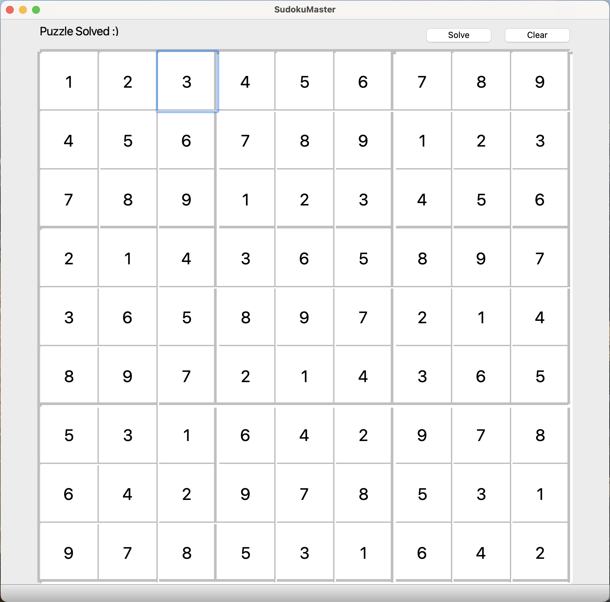

# P10_Sudoku_Master
A program that solves any sudoku puzzle and provides an intuitive user experience.



https://github.com/ttwag/P10_Sudoku_Master/assets/113254272/8f4533a9-1f42-496b-8e0a-a60d453bad1c


## What is the Sudoku Puzzle?
A sudoku puzzle is a 9x9 board with some pre-filled number.
You solved a sudoku puzzle if and only if:
1. You filled in every cell in the board.
2. Each row has number 1-9 with no repeat.
3. Each column has number 1-9 with no repeat.
4. Each 3x3 quadrant has number 1-9 with no repeat.

## Installation
 
### Linux
Clone and go to the P10_Sudoku_Master directory, then enter the following commands:

```
$ cd Sudoku3/Sudoku
$ cmake .
$ make
$ ./Sudoku
```

Note: the commands assumed you have qt libraries, c++ compiler, and CMake installed.

If you haven't installed the qt library, please enter:

```
# Install the qt library

$ sudo apt install qt6-base-dev
```

## How to Use This Program

After launching the Sudoku program, fill in the numbers given by the problem, then click the "Solve" button to solve it.

If you want to clear the numbers, click the "Clear" button to clear everything.

The message box on the top left could display these messages:
* **Please Enter the Numbers**: enter numbers given by the problem.
* **Puzzle Solved**: your sudoku board is solved.
* **Bad Inputs**: you gave an input that's not number 1 - 9.
* **Unsolvable Puzzle**: the input sudoku board does not have a solution. EX: you entered identical number in a row.


## Development Versions
### Sudoku1 - 3x3 Sudoku
* Designed a solver that solves the 3x3 sudoku puzzle. Disregard the quadrant constraint.
* Implemented the solver in C++.
* Tested the program with test cases.
### Sudoku2 - 9x9 Sudoku
* Expanded the Sudoku1 to cover 9x9 sudoku and the quadrant constraint.
* Revised the C++ code.
* Tested the program with test cases.
### Sudoku3 - 9x9 Sudoku with User Interface
* Constructed the GUI by the C++ qt library. 
* The user fills out the initial value and hit a button, 
then the program solves it.
* Tested unexpected user inputs such as entering 0, non-digit character, or same numbers in a row.


## Dependencies and File Structure
This repository contains Sudoku1, Sudoku2, and Sudoku3. 

The CMakeLists.txt inside the P10_Sudoku_Master directory creates Makefile for the Sudoku1 and Sudoku2 programs.

### Sudoku1 File Structure
* **CMakeLists.txt**: specifies the files to be compiled.
* **SudokuSolver.cpp**: contains the functions to solve the 3x3 sudoku puzzle. It has explanation on how the backtracking algorithm works.
* **main.cpp**: calls the test function to validate the 3x3 sudoku solver. 
* **test.cpp**: contains 5 test cases for the 3x3 sudoku solver, performs the test, and prints the test results.

### Sudoku2 File Structure
* **CMakeLists.txt**: specifies the files to be compiled.
* **SudokuSolver.cpp**: contains the functions to solve the 9x9 sudoku puzzle.
* **main.cpp**: calls the test function to validate the 9x9 sudoku solver. 
* **test.cpp**: contains 10 test cases for the 3x3 sudoku solver, performs the test, and prints the test results.

### Run Sudoku1 and Sudoku2
Sudoku1 and Sudoku2 currently execute two C++ test scripts that test the 3x3 and 9x9 Sudoku solvers.

To run Sudoku1 and Sudoku2, 
clone the repository and head inside the main P10_Sudoku_Master directory


Build the two programs in Linux or macOS terminal with 
```
# In P10_Sudoku_Master directory

$ cmake .
$ make
```

then inside Sudoku1 or Sudoku2, 

```
# In Sudoku1 directory

$ ./Sudoku1     # Execute Sudoku1 executable

# In Sudoku2 directory

$ ./Sudoku2     # Execute Sudoku2 executable
```

Note: your system will need a C++ compiler and CMake installed.

### Sudoku3
Sudoku3 contains the GUI app. Its installation guide is included in the Installation section.
You would need to install the qt6-base-dev package, the C++ compiler, and CMake in the system to build this program.
The qt6-base-dev contains qt library function's header files used by this program to create the GUI.

To install qtbase5-dev in Ubuntu:
```
# Run this command in the Ubuntu terminal

$ sudo apt install qt6-base-dev
```

### Sudoku3 File Structure
* **CMakeLists.txt**: an independent CMakeLists that only build Sudoku3. 
* **SudokuSolver.cpp**: contains the same 9x9 Sudoku solver functions as in Sudoku2.
* **sudokumaster.cpp**: instructs the GUI to handle user input.
* **sudokumaster.ui**: builds the frontend of the GUI.
* **main.cpp**: starts and ends the GUI.

### Other Files
* **Figure1.png**: an image in README that demonstrates the program. 
 

## Development Environment
The sudoku solver's logic was developed in Visual Studio Code 1.85.1 for Darwin arm64 23.2.0 and Clion 2023.3.2 for macOS arm64.

The GUI was developed in Qt Creator 12.0.0 based on Qt6.6.0 (Clang 13.0 (Apple), arm64).

## Helpful Links
There are some web sudoku problems that you could play with this solver: https://www.websudoku.com

The test cases for 9x9 sudoku came from: Test cases come from: https://mathsphere.co.uk/downloads/sudoku/10203-hard.pdf

If you are excited and want to build a solver yourself, you could try out LeetCode [Problem 37](https://leetcode.com/problems/sudoku-solver/) and its related problems.